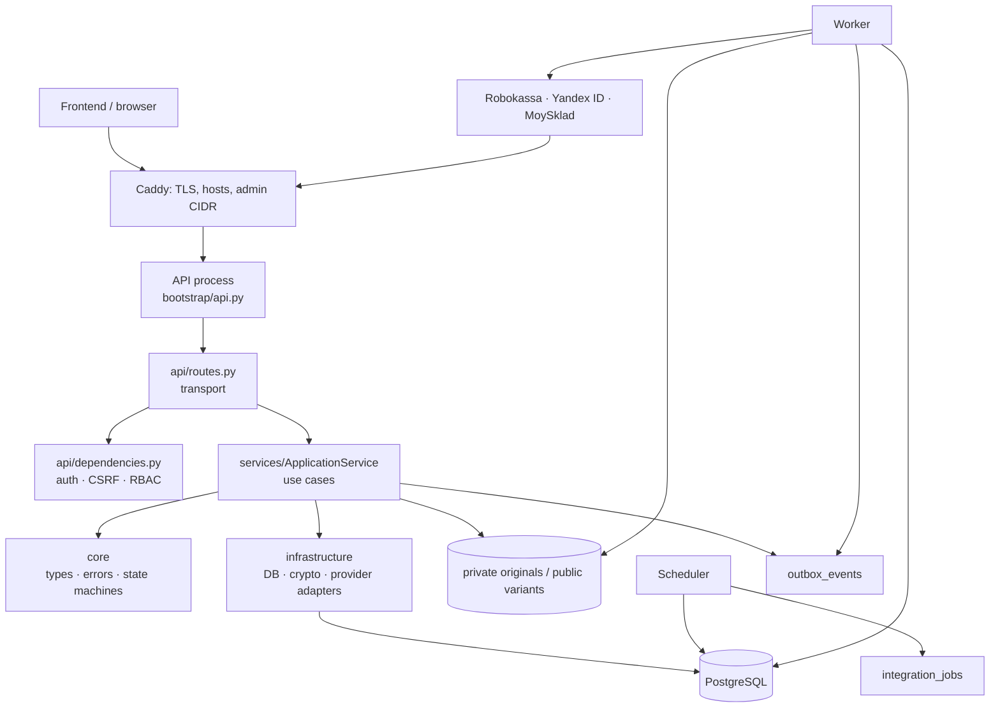
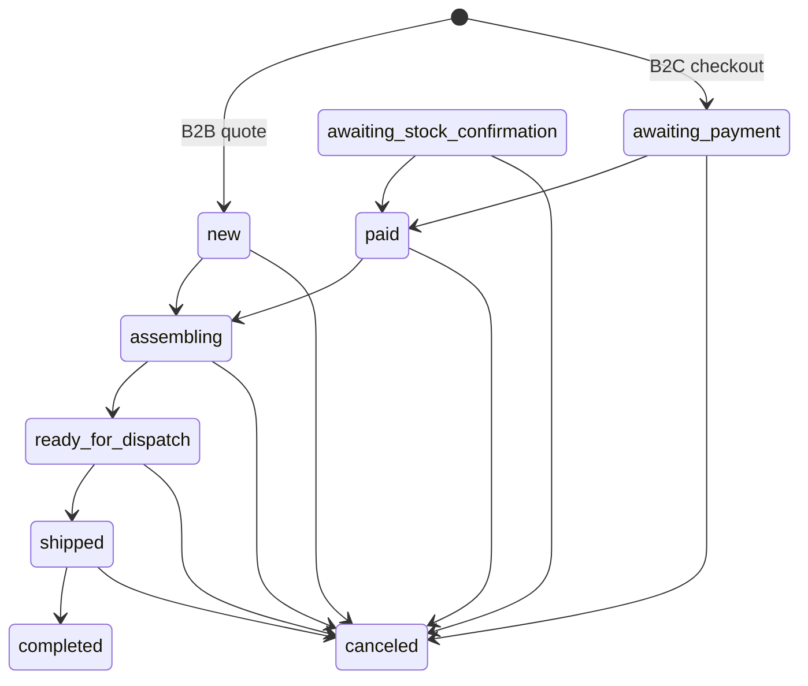
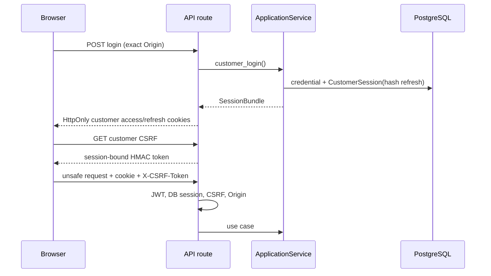

# Kosto‑Vet backend: карта сервиса и руководство по коду

Документ описывает фактическое устройство backend: границы слоёв, назначение модулей, данные и runtime-потоки. Внешний HTTP-контракт всегда берётся из [golden OpenAPI](../contracts/openapi.v1.yaml), а не из этого текста.

## 1. Назначение и runtime

Kosto‑Vet — модульный монолит на FastAPI, async SQLAlchemy и PostgreSQL. Один пакет `src/kosto_vet` запускается тремя процессами.

| Процесс | Команда | Ответственность |
|---|---|---|
| API | `kosto-vet api` | HTTP, cookies, валидация, RBAC, бизнес-сценарии |
| Worker | `kosto-vet worker` | outbox, jobs интеграций, image pipeline, retry/dead-letter |
| Scheduler | `kosto-vet scheduler` | housekeeping, истёкшие резервы, постановка sync/purge jobs |

`core` не импортирует FastAPI, Pydantic, SQLAlchemy или provider SDK. HTTP-код не содержит checkout/CMS правил, worker не содержит HTTP-маршрутов.

## 2. Пакеты и правило зависимостей

| Путь | Слой | Назначение | Может зависеть от |
|---|---|---|---|
| `core/` | чистое ядро | типы денег/статусов, state machine, ошибки | Python stdlib |
| `services/` | application/use cases | сценарии каталога, identity, checkout, CMS, sync | `core`, infrastructure модели/адаптеры |
| `api/` | inbound HTTP adapter | Pydantic input, dependencies, cookies, routes | services, core, infrastructure |
| `infrastructure/` | outbound adapter | ORM, PostgreSQL, crypto, rate limit, provider HTTP | core, settings |
| `bootstrap/` | composition/runtime | settings, FastAPI app, middleware, worker, scheduler | все слои |
| `cli.py` | operator interface | migrations, seed, reviewed imports, S3 probe | bootstrap/infrastructure |
| `alembic/` | schema evolution | миграции PostgreSQL | ORM metadata |
| `contracts/` | external contract | golden OpenAPI 3.1 | не зависит от кода |
| `deploy/` | эксплуатация | Caddy, backup, S3 CORS, systemd | Docker/host |

Порядок работы при новой функции: правило в `core`/`services` → persistence/model + Alembic → HTTP schema/route → OpenAPI + tests. Нельзя переносить бизнес-правило только в route handler.

## 3. Сквозные инварианты

| Инвариант | Реализация | Зачем |
|---|---|---|
| ID | `core.types.new_id()` создаёт UUIDv7 | временно сортируемые, неугадываемые первичные ключи |
| Время | `utc_now()` и timezone-aware columns | одна шкала для OAuth, reservation и jobs |
| Деньги | `*_minor` как `int` | нет ошибок float при цене/оплате |
| Concurrent edits | `VersionMixin.version` + `If-Match` | optimistic concurrency |
| Токены | в БД только `token_hash()` | refresh/order access token нельзя восстановить из БД |
| Idempotency | `idempotency_records` | безопасный повтор checkout, upload, retry payment |
| Audit | `audit_log` | staff mutation имеет actor, before/after, request ID |
| Async side effects | outbox/jobs c lease | commit заказа не зависит от немедленной доставки |

## 4. Core: чистые правила

### `core/types.py`

| Символ | Роль |
|---|---|
| `new_id()` | UUIDv7 для первичных ключей/family IDs |
| `utc_now()` | единственный источник текущего UTC |
| `OrderStatus` | `new`, `awaiting_stock_confirmation`, `awaiting_payment`, `paid`, `assembling`, `ready_for_dispatch`, `shipped`, `completed`, `canceled` |
| `PaymentStatus` | `not_required`, `created`, `pending`, `succeeded`, `canceled`, `expired`, `failed` |
| `StockState` | public UI состояние `available`, `low`, `out`, `unknown` |
| `StaffRole` | `admin`, `manager`, `content`, `readonly` |
| `Money` | immutable value object; запрещает отрицательную сумму и валюту не RUB |
| `stock_state(quantity, stale=False)` | stale → `unknown`; `<=0` → out; `1..10` → low |
| `ORDER_TRANSITIONS` | разрешённый граф статусов заказа |
| `ensure_transition(current, target)` | fail-fast проверка графа перед admin mutation |

### `core/errors.py`

`DomainError` — ожидаемый отказ use case: `code`, безопасное `message`, HTTP `status_code`, `retryable`, `field_errors`, `meta`. API middleware превращает его в `{ok:false,error:{...}}`.

* `not_found()` — 404, не раскрывает внутреннюю причину.
* `forbidden()` — 403 для RBAC/ownership.
* `feature_disabled(feature)` — 503 для сознательно не выпущенной функции.

## 5. Infrastructure: адаптеры и persistence

### `infrastructure/database.py`

`Database.__init__(settings)` создаёт `AsyncEngine` с `pool_pre_ping`, pool size/overflow из settings. `session()` выдаёт request/job-scoped `AsyncSession`; commit делает use case явно. `close()` dispose engine при shutdown.

### `infrastructure/models.py`: таблицы

Каждая ORM-сущность — persistence model, а не DTO. `UUIDTimestampMixin` добавляет UUIDv7/UTC timestamps, `VersionMixin` — version.

| Группа | Таблицы | Что хранится |
|---|---|---|
| Customer identity | `CustomerAccount`, `CustomerCredential`, `CustomerOAuthAccount`, `CustomerSession`, `OAuthTransaction`, `CustomerConsent`, `CustomerDeliveryAddress` | профиль, Argon2 password, Yandex subject, hashed refresh family, single-use PKCE state, consent, customer-owned saved delivery addresses |
| Staff identity | `StaffUser`, `StaffSession` | независимые staff credentials/roles/session family |
| Catalogue | `Category`, `Product`, `ProductSpec`, `RelatedProduct` | materialized category path, цена в minor units, `moysklad_id`, характеристики, related graph |
| Legacy media | `ProductImage`, `ProductImageVariant` | transitional imported product media; CMS runtime использует generic media |
| CMS | `Article`, `MediaAsset`, `MediaVariant`, `ProductMedia`, `ArticleMedia` | Markdown, private originals, public variants, article/product links |
| Inventory | `Warehouse`, `StockItem`, `StockReservation` | склад, sync freshness и time-bounded reservation |
| Commerce | `Cart`, `CartItem`, `Favorite`, `Order`, `OrderItem`, `OrderStatusHistory`, `PaymentAttempt`, `PaymentCallback` | cart snapshots, public order token hash, immutable order snapshots, payment/callback evidence |
| Leads/settings | `Lead`, `StockSubscription`, `PublicSetting`, `LegalDocumentVersion` | формы, opt-in ожидания, public config, legal version |
| Reliability | `OutboxEvent`, `IntegrationJob`, `IntegrationAttempt`, `SyncCursor`, `IdempotencyRecord`, `AuditLog`, `RateLimitBucket` | durable delivery, leases, retries, watermarks, replay, audit, PostgreSQL limiter |

Ключевые DB guardrails: unique email/product slug/article slug/provider subject/payment `inv_id`/callback fingerprint/idempotency triple; check constraints для RUB, неотрицательных денег/остатков и допустимых enum; partial unique index для одной active cart и одного active payment attempt.

### `infrastructure/security.py`

| Функция/класс | Роль |
|---|---|
| `normalize_email` | trim + casefold для логина |
| `hash_password`, `verify_password` | Argon2id; dummy hash против user-enumeration timing |
| `random_token`, `token_hash` | URL-safe secret и его SHA-256 persistence representation |
| `AccessClaims` | typed decoded short-lived access JWT |
| `issue_access_token` | HS256 JWT: `sub`, `sid`, `aud`, issuer, iat/exp, staff role; customer/staff secrets разные |
| `decode_access_token` | signature + issuer + audience + required claims |
| `issue_csrf`, `verify_csrf` | HMAC-token, привязанный к audience и конкретной session |

### `infrastructure/rate_limit.py`

`scope_digest()` делает keyed, необратимый scope hash: raw login/IP не попадает в БД. `enforce_rate_limit()` использует PostgreSQL `INSERT … ON CONFLICT DO UPDATE`, считает fixed window, выставляет `blocked_until`, commit-ит и при превышении возвращает retryable `RATE_LIMITED`/429 с `Retry-After`.

### `infrastructure/integrations.py`

| Адаптер/метод | Что делает |
|---|---|
| `RobokassaAdapter.create_confirmation` | canonical hosted form, Decimal-exact sum, `Shp_*`, signature |
| `RobokassaAdapter.verify_result` | constant-time ResultURL signature verification |
| `RobokassaAdapter.operation_state_request` | production-only OpStateExt request shape |
| `YandexIdAdapter.authorization_url` | OAuth Authorization Code + PKCE URL |
| `YandexIdAdapter.identity` | token exchange и profile request через Authorization header |
| `MoySkladAdapter.fetch_pages` | read-only paginated API, bearer token, timeout, 429/Retry-After |
| `_hash`, `encode_pkce_verifier`, `safe_payload_hash` | provider signature, PKCE S256, stable request fingerprint |

## 6. Services: application use cases

### `services/application.py`: `ApplicationService`

Центральный application facade. Конструктор хранит settings, `RobokassaAdapter`, `YandexIdAdapter` и Fernet, которым защищается order access token в idempotency response. Route handler не должен обходить этот слой для бизнес-операции.

#### Общие и каталог

| Метод | Назначение и связи |
|---|---|
| `money`, `manager` | serialise minor money и сохраняют manager snapshot из settings |
| `public_settings` | delivery price, TTL, manager; если цена не задана — `DELIVERY_PRICE_NOT_CONFIGURED`/503 |
| `_stock_map`, `_images` | bulk-read inventory и generic/legacy images для public product payload |
| `products_to_public` | Product ORM → public card с stock state и media |
| `list_products` | published+active products, filters/search/category/pagination |
| `product_detail` | specs, related products, media; `include_inactive` только для internal admin use |
| `category_tree`, `category_detail` | published category tree и subtree detail по materialized path |
| `suggestions` | ограниченные search suggestions по published products |
| `create_lead` | honeypot + persistent rate-limit + product lookup + consent/Lead |
| `create_stock_subscription` | opt-in ожидание товара с теми же anti-spam принципами |

#### Identity и sessions

| Метод | Назначение | Гарантия |
|---|---|---|
| `start_yandex` | проверяет local return path, создаёт 10-minute OAuth transaction, шифрует verifier | PKCE/state, нет open redirect |
| `complete_yandex` | lock/consume state, получает identity, link/auto-link/create customer, логинит при purpose=login | state нельзя replay; secure auto-link отзывает старые sessions и выключает password credential |
| `unlink_yandex` | удаляет Yandex link | запрещает удалить последний login method |
| `customer_public`, `_customer_payload` | customer envelope и linked auth providers | email read-only через PATCH API |
| `_create_customer_session` | генерирует raw refresh, создаёт family/session с hash, выпускает access JWT | raw refresh не сохраняется |
| `register` | unique normalized email, customer + consent + credential + session | один commit |
| `customer_login`, `staff_login` | проверяют active identity/credential и создают session family | staff/customer namespaces не смешиваются |
| `rotate_session` | lock old refresh, новая session row; replay отозванного refresh отзывает всю family | rotating refresh/replay defence |
| `revoke_refresh` | logout отзывает все active sessions family | logout invalidates family |
| `customer_me`, `update_customer` | get/update profile | ownership via dependency, optional version conflict |
| `delivery_address_payload`, `list_delivery_addresses`, `create_delivery_address`, `update_delivery_address`, `delete_delivery_address` | address CRUD: customer-owned list, first/default rule, `FOR UPDATE` + version/ETag and replacement default after deletion | address never alters existing order delivery snapshots |

#### Idempotency, cart, favorites

| Метод | Назначение |
|---|---|
| `_idempotency_replay` | ищет `(actor_scope, endpoint, key)`, сверяет request hash, возвращает сохранённый ответ или 409; расшифровывает order access token только для replay |
| `_save_idempotency` | сохраняет protected response, status/resource и TTL; financial entries живут дольше |
| `_cart`, `cart_payload` | get/create active cart, выдача live product view и price snapshots |
| `upsert_cart_item`, `update_cart_item`, `delete_cart_item`, `merge_cart` | customer-scoped cart mutations и merge guest positions после login |
| `favorites`, `add_favorite`, `delete_favorite` | list/add/remove favourite; дубликаты дополнительно исключает DB unique constraint |

#### Checkout, orders и payment

| Метод | Назначение |
|---|---|
| `_order_products` | UUID-normalization; проверка active+published product; stable sort и `FOR UPDATE` stock lock для checkout; unknown product → declared domain error |
| `create_order` | общий B2B quote/B2C checkout: цена/stock/resevations → order/item snapshots/consent/history/outbox/idempotency, а B2C ещё и Robokassa attempt/redirect |
| `verify_order_token` | constant-time guest access token check; ошибка маскируется 404 |
| `order_payload` | public или admin model; admin получает contact/legal snapshots и version |
| `retry_payment` | истекает старые attempts, снова lock-ит stock, обновляет reservation, создаёт redirect только без active attempt |
| `process_robokassa` | signature/amount/order verification, callback dedupe/evidence, payment/order/reservation transition, ответ `OK<InvId>` |
| `list_customer_orders`, `list_admin_orders` | paginated views; ownership/RBAC остаются в transport dependencies |
| `update_admin_order` | lock + expected version + `ensure_transition`; writes history/audit; cancel releases reservation; late-payment path фиксирует intermediate `paid` history |

#### CMS: articles и media

| Метод | Назначение |
|---|---|
| `_validate_markdown` | normalizes line endings и отвергает raw HTML tags |
| `_media_payload` | asset status, dimensions, safe error, only public variants; original URL никогда не выходит наружу |
| `article_payload` | article + ready media, определяет cover |
| `list_public_articles`, `public_article` | только `published` и с `published_at`; draft/archived возвращают 404 |
| `list_admin_articles`, `admin_article` | staff view без public visibility filter |
| `create_article` | idempotency + Markdown validation + unique slug + audit |
| `update_article` | `FOR UPDATE`, expected version, SEO/status/Markdown/published timestamp + audit |
| `_s3_client` | создаёт S3 client только при complete config, иначе 503 FEATURE_DISABLED |
| `create_media_upload_intent` | `pending_upload` asset + 10-minute presigned **POST** в private originals bucket; API bytes не принимает |
| `complete_media_upload` | S3 HEAD/size/MIME validation → `processing` + durable `media/process` job + audit |
| `admin_media` | polling status/variants/error |
| `attach_article_media`, `update_article_media`, `delete_article_media` | versioned article links; only ready; cover uniqueness; detach может retire asset |
| `product_media_payload`, `attach_product_media`, `update_product_media`, `delete_product_media` | versioned product gallery; only ready; один primary; не более 12 links |
| `_retire_unused_asset` | без product/article links переводит ready asset в deleted с `purge_after=+30d` |

#### Admin reads и jobs

| Метод | Назначение |
|---|---|
| `list_admin_customers`, `admin_customer` | список/detail, orders count и total spent |
| `list_leads`, `lead_payload`, `update_lead` | queues/filters/status update с version и audit |
| `update_product` | presentation/SEO/active update, version + audit; permission только content/admin |
| `list_jobs` | последние 100 integration jobs без secrets |
| `trigger_sync` | ставит explicit full `moysklad/catalog` job; route доступен admin |

### `services/moysklad.py`

| Метод | Роль |
|---|---|
| `_integer_quantity` | provider number → safe integer; invalid/NaN → 0 |
| `_provider_updated_at` | provider datetime или fallback UTC now |
| `_price_minor` | выбирает цену только configured price type |
| `_checkpoint` | upsert resource watermark в `SyncCursor` после success |
| `_product_by_identity` | находит **существующий** product по external ID, затем article |
| `sync_moysklad` | PostgreSQL advisory lock; catalog incremental/full обновляет only mapped products; stock sync обновляет warehouse/stock; unknown provider goods только `skipped`, не создаются и не публикуются |

## 7. API layer: схемы, зависимости и transport

### `api/schemas.py`

Каждый input наследует `StrictModel`: `extra="forbid"`, trim strings. Группы schemas:

| Группа | Классы |
|---|---|
| Lead/catalog | `LeadCreate`, `StockSubscriptionCreate` |
| Order | `OrderItemInput`, `CustomerContactInput`, `LegalEntityInput`, `DeliveryInput`, `QuoteCreate`, `CheckoutCreate`, `PaymentAttemptCreate` |
| Customer | `CustomerRegister`, `Login`, `CustomerUpdate`, `CartItemUpsert`, `CartItemUpdate`, `CartMerge`, `FavoriteCreate`, reset schemas |
| Admin ops | `AdminOrderUpdate`, `AdminLeadUpdate`, `SeoInput`, `ProductUpdate` |
| CMS | `ArticleCreate`, `ArticleUpdate`, `MediaUploadIntentCreate`, `MediaAttach`, `ArticleMediaAttach`, `MediaLinkUpdate` |

`website` в public form schema — honeypot. Length/UUID/email/literal/quantity validation происходит до service layer.

### `api/dependencies.py`

| Символ | Проверка |
|---|---|
| `Principal` | authenticated actor: subject, session ID, audience, staff role |
| `get_session` | request-scoped `AsyncSession` из `app.state.database` |
| `_principal` | JWT decode + session row + expiry/revocation |
| `customer_principal`, `optional_customer_principal`, `staff_principal` | берут правильную cookie/audience; invalid customer cookie не становится guest |
| `csrf_dependency`, `customer_mutation`, `staff_mutation` | access cookie + `X-CSRF-Token`, привязанный к той же session/audience |
| `PERMISSIONS` | admin all; manager orders/customers/leads/jobs; content products/articles/media; readonly только read queues |
| `require_permission` | выбирает обычный или CSRF staff dependency и проверяет permission |

### `api/routes.py`

Routes преобразуют HTTP в service call. Общие helpers: `_client_scope()` для limiter; `service()` factory; `_set_cookies()`/`_clear_cookies()` для раздельных namespaces; `_etag_version()` для `If-Match`; `_refresh_row()`/`_verify_refresh_csrf()` для refresh protection.

| Область | Routes | Назначение |
|---|---|---|
| Health | `GET /health/live`, `/health/ready` | liveness и PostgreSQL readiness |
| Public catalogue | `GET /catalog/categories`, `/categories/{slug}`, `/products`, `/products/{slug}`, `/search-suggestions`, `/settings/public` | tree, cards, search, settings |
| Public content | `GET /articles`, `/articles/{slug}` | published Markdown articles |
| Leads | `POST /leads`, `/stock-subscriptions` | consent/honeypot/rate-limited forms |
| Guest B2B/B2C | `POST /orders/quote`, `/orders/checkout`; `GET /orders/{public_id}`; payment attempts | quote, checkout, owner-token order access, retry |
| Customer auth | register/login/refresh/CSRF/logout under `/customer/auth/*` | `{customer: ...}`, rotating cookies |
| Yandex | start/callback/link/unlink | OAuth PKCE login/link |
| Account | me, manager, saved delivery addresses, orders, cart, favorites | customer-only; unsafe endpoints require CSRF |
| Payments | Robokassa result/success/fail | provider callback + browser redirects |
| Staff auth | `/admin/auth/*` | isolated staff cookies/audience |
| Admin ops | orders/customers/leads/products/integration jobs/sync | `require_permission`, audit/version on mutation |
| Admin CMS | articles, media, product/article links | content/admin lifecycle, S3 intent/complete, attach/reorder/alt/primary/cover |

Точные method, status, headers, cookies и operation IDs приведены в `contracts/openapi.v1.yaml`; `tests/test_contract.py` не позволяет inventory расходиться с route declarations.

### Полный inventory route handlers

В этой таблице перечислены методы именно `api/routes.py`. `GET` без mutation обычно требует только indicated principal/permission; все unsafe customer/staff routes дополнительно проходят middleware Origin check и соответствующий CSRF dependency.

| Handler | HTTP endpoint | Непосредственная работа |
|---|---|---|
| `live` | `GET /health/live` | constant liveness payload |
| `ready` | `GET /health/ready` | PostgreSQL `SELECT 1` readiness |
| `list_categories`, `get_category` | `GET /catalog/categories`, `/{slug}` | `category_tree` / `category_detail` |
| `public_settings` | `GET /settings/public` | `ApplicationService.public_settings` |
| `list_products`, `get_product`, `search_suggestions` | `GET /catalog/products`, `/{slug}`, `/search-suggestions` | catalogue service queries |
| `list_articles`, `get_article` | `GET /articles`, `/{slug}` | public article queries |
| `create_lead`, `create_stock_subscription` | `POST /leads`, `/stock-subscriptions` | payload/honeypot/rate-limit service calls |
| `create_quote`, `checkout` | `POST /orders/quote`, `/orders/checkout` | `create_order(quote=True/False)`, idempotency key |
| `get_public_order`, `retry_payment` | `GET /orders/{public_id}`, `POST …/payment-attempts` | order access token verification, payload/retry |
| `register_customer`, `login_customer` | `POST /customer/auth/register`, `/login` | rate-limit, service call, customer cookies |
| `refresh_customer` | `POST /customer/auth/refresh` | refresh CSRF + `rotate_session`, replaces cookies |
| `customer_csrf`, `logout_customer` | `GET /customer/auth/csrf`, `POST /logout` | session-bound HMAC / revoke family + clear cookies |
| `yandex_start`, `yandex_callback` | `GET /customer/auth/yandex/start`, `/callback` | start/complete OAuth; callback redirect + cookie issue when login |
| `yandex_link`, `yandex_unlink` | `POST /customer/auth/yandex/link`, `DELETE /unlink` | customer CSRF + start/unlink service |
| `password_reset_request`, `password_reset_confirm` | `POST /customer/auth/password-reset/*` | deliberate `FEATURE_DISABLED` response |
| `customer_me`, `customer_update`, `customer_manager` | `GET/PATCH /account/me`, `GET /account/manager` | customer identity/profile/manager |
| `list_delivery_addresses`, `create_delivery_address`, `update_delivery_address`, `delete_delivery_address` | `/account/delivery-addresses` | saved addresses; CSRF + `If-Match` for mutation |
| `customer_orders`, `customer_order` | `GET /account/orders`, `/{public_id}` | customer ownership check + order views |
| `get_cart`, `upsert_cart`, `update_cart`, `delete_cart`, `merge_cart` | `/account/cart` и items/merge | customer CSRF cart operations |
| `list_favorites`, `add_favorite`, `delete_favorite` | `/account/favorites` | customer CSRF favorite operations |
| `robokassa_result`, `robokassa_success`, `robokassa_fail` | `/payments/robokassa/*` | signed provider callback; browser success/fail redirect |
| `admin_login`, `admin_refresh`, `admin_csrf`, `admin_logout`, `admin_me` | `/admin/auth/*` | staff sessions/cookies/refresh/CSRF/me |
| `admin_orders`, `admin_order`, `admin_update_order` | `/admin/orders` | orders.read / orders.update, versioned transition |
| `admin_customers`, `admin_customer` | `/admin/customers` | customers.read PII access |
| `admin_leads`, `admin_lead`, `admin_update_lead` | `/admin/leads` | leads.read / leads.update |
| `admin_update_product` | `PATCH /admin/products/{id}` | products.update; content/admin presentation/SEO |
| `admin_list_articles`, `admin_create_article`, `admin_get_article`, `admin_update_article` | `/admin/articles` | articles.read/write, idempotency create, `If-Match` update |
| `create_media_upload_intent`, `get_admin_media`, `complete_media_upload` | `/admin/media/*` | media.write/read, idempotency intent/complete |
| `attach_article_media`, `update_article_media`, `delete_article_media` | `/admin/articles/{id}/media/*` | articles.write + media link versioning |
| `admin_list_product_media`, `attach_product_media`, `update_product_media`, `delete_product_media` | `/admin/products/{id}/media/*` | products/media permissions + product versioning |
| `integration_jobs`, `trigger_sync` | `/admin/integrations/sync-jobs`, `/moysklad/sync` | integrations.read; admin-only full catalog sync |

## 8. Bootstrap: composition и процессы

### `bootstrap/settings.py`

`Settings` — typed Pydantic Settings из env/`.env`: runtime/database, delivery/stock, customer/staff/CSRF secrets, provider modes, S3, notifications. `parse_list()` разбирает comma-separated origins/hosts/CIDRs; `validate_origins()` запрещает wildcard, path/query/fragment и trailing slash.

`production_guards()` fail-closed требует:

1. три независимых 256-bit customer/staff/CSRF secrets;
2. HTTPS API, secure cookies и HTTPS exact frontend/admin origins;
3. delivery price;
4. complete S3 credentials/buckets/public base URL и admin origin, если S3 включён;
5. token + warehouse + price type для enabled MoySklad, HTTPS URL в production;
6. production Robokassa всегда блокируется в demo release.

`get_settings()` cache-ит единый Settings instance на процесс. `Mode` имеет `disabled`, `sandbox`, `production`.

### `bootstrap/api.py`

| Компонент/метод | Работа |
|---|---|
| `lifespan` | создаёт `Database`, кладёт в `app.state`, dispose на shutdown |
| `TrustedHostMiddleware` | допускает только `TRUSTED_HOSTS` |
| `CORSMiddleware` | exact `FRONTEND_ORIGINS`, credentials и ограниченный набор custom headers |
| `security_and_observability` | `X-Request-ID`, exact Origin для unsafe cookie auth, exception для signed Robokassa callback, no-store account/admin/auth, structured log, Prometheus counter/histogram |
| `handle_domain_error` | canonical business error envelope и `Retry-After` |
| `handle_validation_error` | 422 field errors, без FastAPI default body |
| `handle_unexpected_error` | stack trace только в log, наружу safe `INTERNAL_ERROR` |
| `metrics` | hidden from schema; internal network или live admin only |
| `integration_health` | hidden internal/admin modes, без provider secrets |
| `canonical_openapi` | читает golden YAML; runtime `/openapi.json` не генерируется из decorators |

### `bootstrap/worker.py`

Worker — durable queue consumer. `retry_delay(attempt)` строит capped exponential backoff с jitter.

| Метод | Работа |
|---|---|
| `_claim_events`, `_finish_event` | `FOR UPDATE SKIP LOCKED`/lease для outbox; processed/retry/dead status с safe error |
| `_dispatch_event` | текущая расширяемая точка dispatch; side effect не выполняется внутри request transaction |
| `_claim_job`, `_finish_job` | тот же lease/retry/dead-letter протокол для `integration_jobs`, плюс `IntegrationAttempt` telemetry |
| `_run_job` | provider dispatch: MoySklad, media process, media purge |
| `_process_media` | private original → size/magic/MIME probe → libvips decode/40 MP limit/orientation normalize → immutable WebP `thumb` 320, `card` 640, `detail` 1280, `zoom` 2048 без crop/metadata → public bucket; ready или failed+safe code |
| `_purge_media` | удаляет public variants и private original после 30 days, когда asset больше не linked |
| `run_once`, `main` | batch outbox + один job, повтор с idle delay |

### `bootstrap/scheduler.py`

`run_once()` берёт PostgreSQL advisory lock, поэтому replicas не дублируют housekeeping. Далее он:

1. помечает active reservations с истёкшим `expires_at` как `expired`;
2. удаляет старые OAuth state, idempotency records и limiter buckets;
3. ставит media purge после `purge_after`, не дублируя active job;
4. при enabled MoySklad ставит catalog job по `MOYSKLAD_CATALOG_SYNC_INTERVAL_SECONDS` и stock job по `MOYSKLAD_STOCK_SYNC_INTERVAL_SECONDS`.

`main()` запускает этот цикл раз в минуту.

### `cli.py`

| Команда/метод | Для чего |
|---|---|
| `seed_demo()` / `seed-demo` | idempotent local demo categories/products/specs/stock/legal version |
| `create_staff()` / `create-staff` | bootstrap/update staff с Argon2 password и одной из четырёх ролей |
| `import_media()` / `import-media` | deployment-time legacy product image import в S3; не admin upload API |
| `_catalog_allowlist`, `_catalog_manifest`, `_required_string` | strict parsing reviewed JSON и approved external IDs |
| `import_catalog()` / `import-catalog` | dry-run default; production requires allowlist; explicitly creates/updates reviewed category/product/warehouse/stock; не перечисляет provider catalogue |
| `verify_s3()` / `verify-s3` | read-only head двух buckets и exact admin-origin CORS check private originals |
| `main()` | argparse: API, worker, scheduler, migrate, seed, staff, imports, S3 probe |

## 9. Сквозные последовательности

### Login и unsafe customer mutation

### B2C checkout

1. Route валидирует `CheckoutCreate`, exact Origin и `Idempotency-Key`.
2. `create_order()` replay-проверяет key; перечитывает products и lock-ит stock в stable order.
3. Проверяются delivery config, freshness, active reservations и availability.
4. Одна transaction создаёт order/items snapshots, 5-minute reservations, consent, history, outbox, payment attempt и idempotency response.
5. Robokassa form уходит браузеру; ResultURL callback валидирует подпись и переводит payment/order.
6. Scheduler expiry и admin cancellation снимают reservation.

### CMS media pipeline

1. Content/admin вызывает upload intent c idempotency key.
2. API сохраняет `MediaAsset(pending_upload)` и отдаёт short-lived presigned **POST** в private originals bucket.
3. Browser отправляет bytes прямо в S3; credentials не видит.
4. `complete` выполняет S3 HEAD и ставит durable `media/process` job.
5. Worker validates magic/MIME/size/pixels, libvips re-encodes variants и публикует только public variants.
6. Только `ready` asset attach-ится к article/product. Последний detach → `deleted`; scheduler purge через 30 дней.

## 10. Миграции, контракт, tests и deploy

| Артефакт | Роль |
|---|---|
| `alembic/versions/0001_demo_schema.py` | initial demo identity/catalog/commerce/reliability schema |
| `alembic/versions/0002_content_and_media.py` | articles + generic media expand/backfill; legacy image tables сохраняются |
| `contracts/openapi.v1.yaml` | единственный public API contract; runtime OpenAPI отдаёт его |
| `tests/test_contract.py` | OpenAPI validation, route/operation/status/security inventory |
| `tests/unit/*` | types, security, CMS, import, integration, settings rules |
| `tests/integration/test_postgres.py` | migration, advisory lock, persistent rate limit |
| `.github/workflows/ci.yml` | lock/sync, Ruff, mypy, OpenAPI, pytest, Alembic smoke, Bandit, pip-audit, image/Trivy/GHCR |
| `docker-compose.yml` | demo: Caddy, frontend, API/worker/scheduler, PostgreSQL, optional Redis |
| `docker-compose.prod.yml` | immutable images, `frontend:80`, backup profile |
| `deploy/caddy/Caddyfile` | exact hosts/TLS/forwarded-header sanitation/admin CIDR |
| `deploy/backup/*` | pg_dump → restic, 7 daily/4 weekly/12 monthly, restore runbook/systemd timer |

## 11. Правила расширения

* **Public endpoint:** OpenAPI → strict schema → route adapter → service use case → contract test.
* **Mutation:** Origin уже middleware; добавьте customer/staff CSRF, idempotency для create/financial/upload, audit для staff business mutation, ETag/version для concurrent edit.
* **Таблица:** ORM model, FK/check/index/unique, отдельная Alembic migration; production schema не правится вручную.
* **Provider:** adapter в infrastructure, orchestration/job в services, handler в worker, settings guards; network side effect не выполняется в route transaction.
* **Новый media consumer:** link table к `MediaAsset`, проверка ready, `_retire_unused_asset` на unlink.

## 12. Осознанно выключенные возможности

Demo release не включает production Robokassa, fiscalization, refunds, email/password-reset delivery, B2B invoices, admin multipart upload или MoySklad writer/reservation/invoice API. До отдельной реализации они должны возвращать объявленный disabled response либо отсутствовать в OpenAPI.
